

  <h3>Loan Approval Prediction</h3>
  
<b>Made with ❤️ for Miuul Data Science Bootcamp by</b>

    Melis Luzumlu 
    Orhan Emre Anıl 
    Emre Yıldırım 
    Yüsra Yanardağ

 

   
The main purpose of the project is to predict whether users loans will be approved or not. The dataset of the Kaggle competition that we will use (both training and testing) was created from a deep learning model trained on the Loan Approval Prediction dataset. The target variable is present in the training set, but the target variable is not present in the test set. We will predict this missing variable with the model that we will create later using the original dataset that we found ourselves. You can find the datasets below. Later, we will share the necessary explanations of the variables with detailed graphics in this document. 

Kaggle Playground Series : <https://www.kaggle.com/competitions/playground-series-s4e10/data>

Original dataset : <https://www.kaggle.com/datasets/laotse/credit-risk-dataset>

You can find our final presentation here : <https://www.canva.com/design/DAGktGhPNEk/MTa3aoD7HC_5D18EyQeygw/view?utm_content=DAGktGhPNEk&utm_campaign=designshare&utm_medium=link2&utm_source=uniquelinks&utlId=h697f9de5bb>

Live Demo : https://predictloanapproval.streamlit.app/

## Columns

1. [person_age](#person_age)
2. [person_income](#person_income)
3. [person_home_ownership](#person_home_ownership)
4. [person_emp_length](#person_emp_length)
5. [loan_intent](#loan_intent)
6. [loan_grade](#loan_grade)
7. [loan_amnt](#loan_amnt)
8. [loan_int_rate](#loan_int_rate)
9. [loan_percent_income](#loan_percent_income)
10. [cb_person_default_on_file](#cb_person_default_on_file)
11. [cb_person_cred_hist_length](#cb_person_cred_hist_length)
12. [loan_status](#loan_status)

## person_age

- Shows person age.
- Variable type is int64 for both train and test.
- We have a customer portfolio that is densely populated with people under the age of 40.
- Our customers over the age of 40 are very rare.
- Our Train and Test data show similar distributions.

  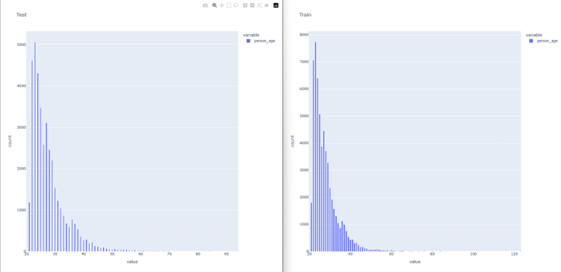

## person_income

- The person's annual income (in USD).
- Variable type is int64 for both train and test
- Our data is comprised of clients with annual incomes under $205,000, but we also have clients with higher annual incomes, but they are a very small minority.
- Our Train and Test data show similar distributions.

  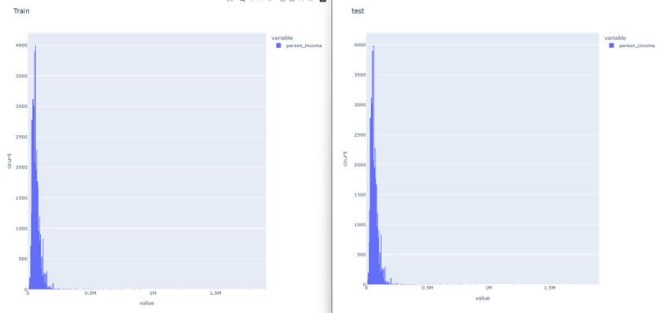

## person_home_ownership

- Shows person home status.
- Variable type is object for both train and test

   - RENT
   - OWN
   - MORTGAGE
   - OTHER

- Our Train and Test data show similar distributions.

  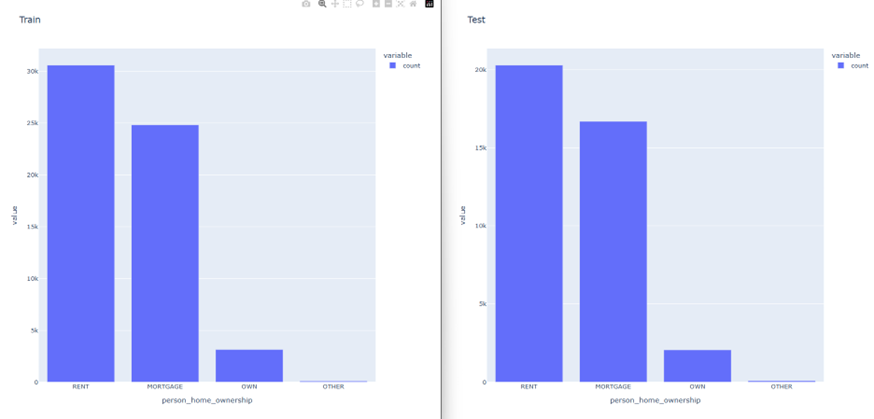

  Original 
  
  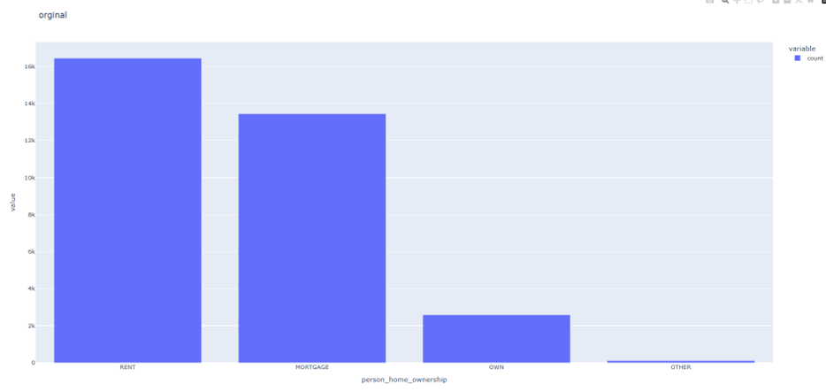

## person_emp_length

- Shows how many years for the applicant has been working
- Variable type is float64 for both train and test
  
  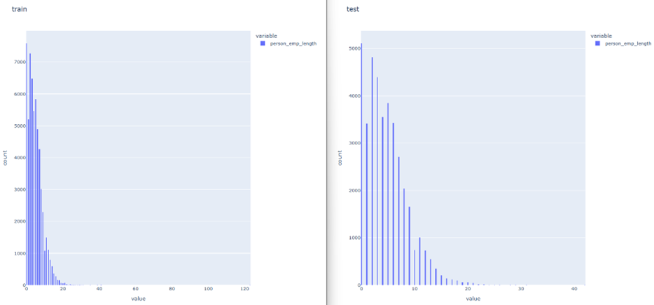

## loan_intent

- The reason why the applicant needs the loan.
- Variable type is object for both train and test

  - **EDUCATION** – **Eğitim**  
    Refers to loans used to finance education-related expenses (e.g., tuition, books, courses).
  - **MEDICAL** – **Tıbbi / Sağlık**  
    Refers to loans taken to cover health-related expenses or health services (e.g., surgery, treatment, medicine).
  - **PERSONAL** – **Kişisel**  
    These are loans taken for general individual needs. They are not tied to a specific purpose; they can have a wide variety of uses such as vacation, shopping or debt settlement.
  - **VENTURE** – **Girişim / Yatırım**  
    It generally refers to investments or initiatives made for the purpose of establishing a new business or expanding an existing business.
  - **DEBT CONSOLIDATION** – **Borç Birleştirme**  
    It is a financial method that allows multiple debts to be paid more easily by combining them into a single loan. The interest rate can be reduced and the payment schedule can be simplified.
  - **HOME IMPROVEMENT** – **Ev Yenileme / İyileştirme**  
    Loans for home renovations, repairs, or improvements (e.g., kitchen renovations, roof repairs, energy efficiency improvements).
        
    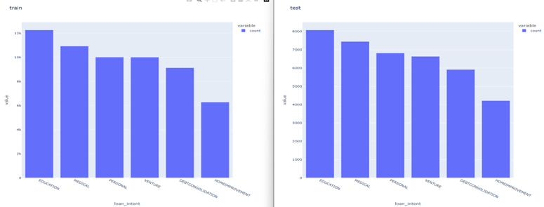
        
## loan_grade

- A score that indicates how reliable the applicant is at repaying loans.
- Variable type is object for both train and test
- A,B,C,D,E,F,G(A is the most reliable segment, others are decreasing)

  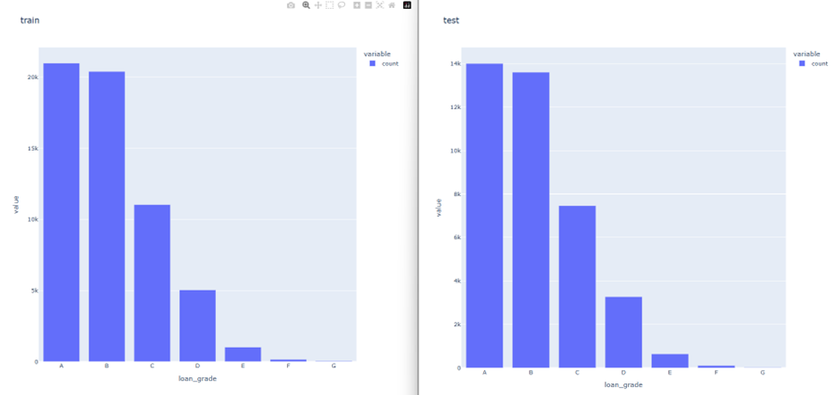
  
## loan_amnt

- Shows that the amount of money the applicant wishes to borrow.
- Variable type is int64 for both train and test

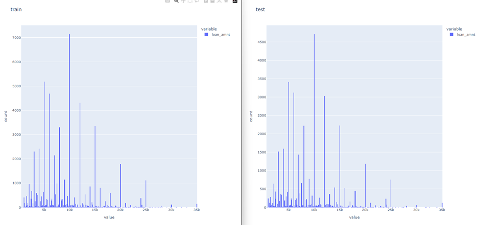

## loan_int_rate

- Shows that the interest rate applied to the loan.
- Variable type is float64 for both train and test
- The expression (loan interest rate) usually indicates the annual interest rate of a loan in percentage (%). The value 11.49 indicates that 11.49% interest is charged annually for this loan.

## loan_percent_income

- Shows that what portion of the applicant's income will go to loan payments.
- Variable type is float64 for both train and test

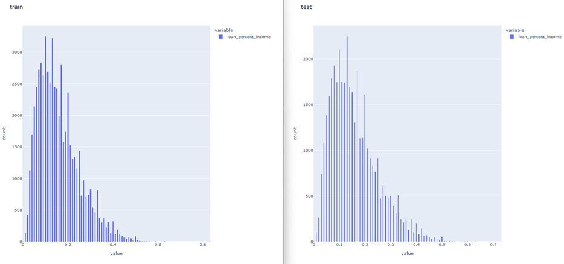

## cb_person_default_on_file

- Indicates whether the applicant has previously failed to repay a loan.
- Variable type is object for both train and test

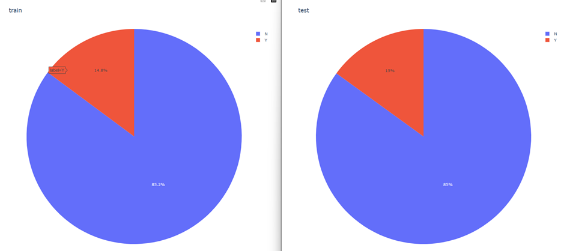

## cb_person_cred_hist_length

- How long the applicant's credit history is.
- Variable type is int64 for both train and test

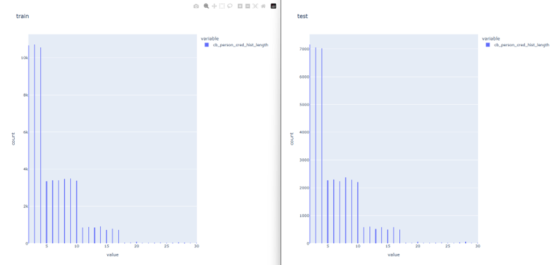

## loan_status

- Indicates whether the loan has been approved or rejected.
- Showns whether the credit is approved or not.
